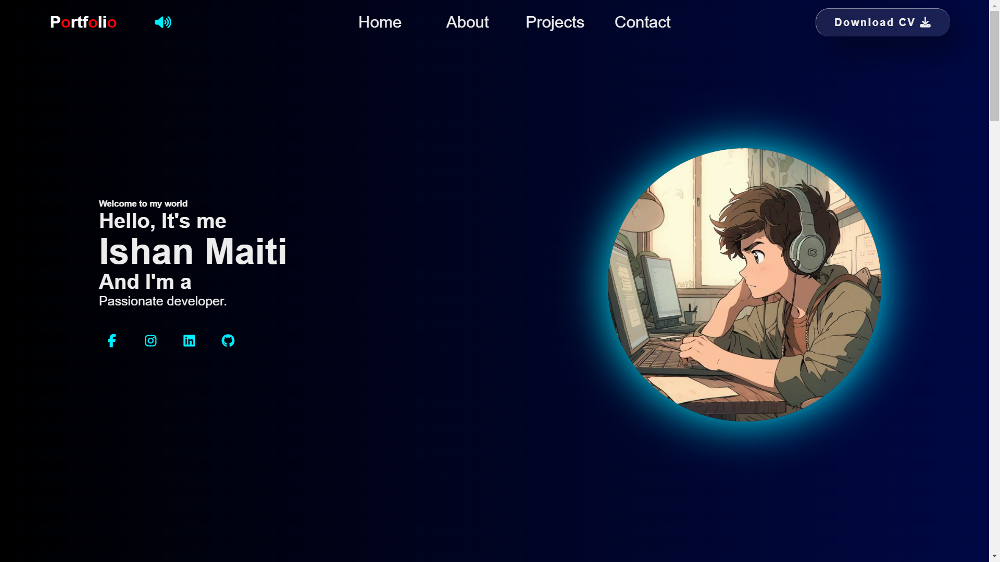

# Portfolio Website

Welcome to my very first portfolio .

## Table of Contents

- [Portfolio Website](#portfolio-website)
  - [Table of Contents](#table-of-contents)
  - [Introduction](#introduction)
  - [Features](#features)
  - [Installation / Fork](#installation--fork)
  - [Star the GitHub Repo](#star-the-github-repo)
  - [Code of the Website](#code-of-the-website)
    - [HTML (index.html)](#html-indexhtml)
    - [CSS (style.css)](#css-stylecss)
    - [JavaScript (script.js)](#javascript-scriptjs)

---

## Introduction

Feel free to explore my Portfolio Website.



<a target="_blank" href="https://Ishan0121.github.io/Portfolio/" target="_blank" style="display: inline-block; padding: 10px 20px; background-color: #3498db; color: #ffffff; text-decoration: none; border-radius: 5px; font-weight: bold; font-size: 16px; margin-bottom: 20px;">Visit Portfolio Website ↗</a>

---

## Features

- **Navigation Menu:**
  - Easy-to-use navigation menu with quick access to different sections.
  - Home,About,Projects,Contact.

- **Interactive:**
  - The website is a little interactive, to enhance the experience.
- **Responsive Design:**
  - The website is designed to be responsive, providing a seamless experience across different devices.

---

## Installation / Fork

To set up the Portfolio website locally or fork it for your own modifications, follow these steps:

1. Clone the repository:

    ```bash
    git https://github.com/Ishan0121/Portfolio.git
    ```

2. Open the `index.html` file in a web browser to view the website locally.

3. Customize the content, styles, or scripts according to your preferences.

4. Make sure to update the repository URL in the cloned version:

    ```bash
    git remote set-url origin https://github.com/Ishan0121/Portfolio.git
    ```

5. Push the changes to your GitHub repository:

    ```bash
    git push origin main
    ```

---

## Star the GitHub Repo

If you find the Portfolio website interesting or useful, consider starring the GitHub repository. Your support is highly appreciated!

---

## Code of the Website

Below is the HTML and CSS code that constitutes the Portfolio website. Feel free to explore and modify the code as needed.

### HTML ([index.html](./index.html.html))

### CSS ([style.css](./style.css))

### JavaScript ([script.js](./script.js))

Thank you for reading .
Made by [Ishan Maiti](https://github.com/Ishan0121).
