# Portfolio Website
Welcome to my very first portfolio .


## Table of Contents
1. [Introduction](#introduction)
2. [Features](#features)
3. [Installation / Fork](#installation--fork)
4. [Star the GitHub Repo](#star-the-github-repo)
5. [Code of the Website](#code-of-the-website)

---

## Introduction
Feel free to explore my Portfolio Website.

<a target="_blank" href="https://Ishan0121.github.io/Portfolio/" target="_blank" style="display: inline-block; padding: 10px 20px; background-color: #3498db; color: #ffffff; text-decoration: none; border-radius: 5px; font-weight: bold; font-size: 16px; margin-bottom: 20px;">Visit Portfolio Website ↗</a>

---

## Features

- **Navigation Menu:**
  - Easy-to-use navigation menu with quick access to different sections.
  - Home,About,Projects,Contact.

- **Interactive:**
  - The website is a little interactive, to enhance the experience.
- **Responsive Design:**
  - The website is designed to be responsive, providing a seamless experience across different devices.

---

## Installation / Fork

To set up the Portfolio website locally or fork it for your own modifications, follow these steps:

1. Clone the repository:
    ```bash
    git https://github.com/Ishan0121/Portfolio.git
    ```

2. Open the `index.html` file in a web browser to view the website locally.

3. Customize the content, styles, or scripts according to your preferences.

4. Make sure to update the repository URL in the cloned version:
    ```bash
    git remote set-url origin https://github.com/Ishan0121/Portfolio.git
    ```

5. Push the changes to your GitHub repository:
    ```bash
    git push origin main
    ```

---

## Star the GitHub Repo

If you find the Portfolio website interesting or useful, consider starring the GitHub repository. Your support is highly appreciated!

---

## Code of the Website

Below is the HTML and CSS code that constitutes the Anime Hunt website. Feel free to explore and modify the code as needed.

### HTML (index.html)
```html
<!DOCTYPE html>
<html lang="en">
<head>
    <meta charset="UTF-8">
    <meta name="viewport" content="width=device-width, initial-scale=1.0">
    <title>Document</title>
    <link rel="stylesheet" href="style.css">
    <!-- font font-awesome -->
    <link rel="stylesheet" href="https://cdnjs.cloudflare.com/ajax/libs/font-awesome/6.5.2/css/all.min.css" integrity="sha512-SnH5WK+bZxgPHs44uWIX+LLJAJ9/2PkPKZ5QiAj6Ta86w+fsb2TkcmfRyVX3pBnMFcV7oQPJkl9QevSCWr3W6A==" crossorigin="anonymous" referrerpolicy="no-referrer" />
    
</head>
<body style="--base1:#000844; --base2:#0ef;">
    <audio id="background-music" autoplay loop>
        <source src="assets/bgm.mp3" type="audio/mpeg"> <!-- Replace with your audio file -->
      </audio>
    <header class="header">
        <a href="#" class="logo">P<span>o</span>rtf<span>o</span>li<span>o</span></a>
        <button id="toggle-music"><i class="fa-solid fa-volume-high"></i></button>
        <nav class="navbar" id="navbar">
            <a href="#home"><span>Home</span></a>
            <a href="#about"><span>About</span></a>
            <a href="#projects"><span>Projects</span></a>
            <a href="#contact"><span>Contact</span></a>
        </nav>

        <a href="#" class="btn-box">Let's Talk</a>
    </header>
    
    <section class="home">
        <div class="home-content">
            <div class="textt" >
                <h5>Welcome to my world</h5>
                <h3>Hello, It's me</h3>
                <h1>Ishan Maiti</h1>
                <h3>And I'm a</h3>
                <p>Passionate developer.</p>
            </div>
            <div class="home-sci">
                <a href="#" style="--clr:#1201f7;"><i class="fa-brands fa-facebook-f"></i></a>
                <a href="#" style="--clr:linear-gradient(45deg ,rgb(235, 93, 5),#eb0023 );"><i class="fa-brands fa-instagram"></i></a>
                <a href="#" style="--clr:#02f706;"><i class="fa-brands fa-whatsapp"></i></a>
                <a href="#" style="--clr:#000000;"><i class="fa-brands fa-github"></i></a>
            </div>
        </div>
            <div class="im"></div>
    </section>

    <section class="about">
        <div class="im"></div>
        <div class="about-content">
            <div class="txtt">
                <h1>About Me</h1>
             <p>
                Hello! I'm a dedicated BSc Computer Science student passionate about harnessing the power of technology to solve real-world problems. With a solid foundation in programming and web development, I have honed my skills across multiple languages and tools.I'm in my first year of B.Sc. I'm learning some languages like C,Java,HTML,CSS,JavaScript,Python and Rust
            </p>
            </div>
            
        </div>
        
      </section>

    <section class="projects">
        
        <h2 class="heading">Latest <span>Projects</span></h2>
        
        <div class="projects-content">
            <div class="projects-box">
                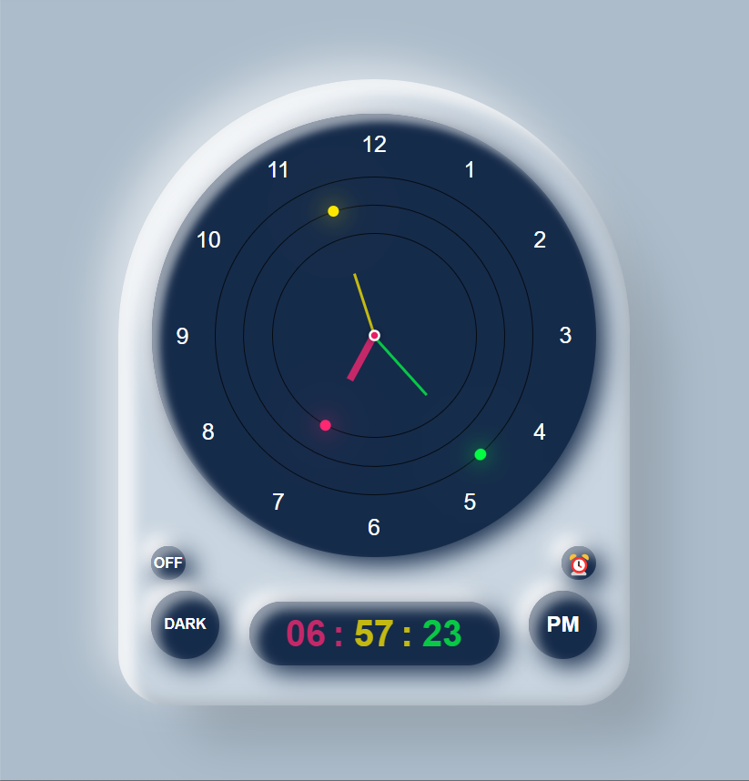
                <div class="projects-layer">
                    <h4>Clock 1</h4>
                    <p>Lorem ipsum dolor sit amet, consectetur adipisicing elit.</p>
                    <a href=""><i class="fa-solid fa-up-right-from-square"></i></a>
                </div>
            </div>
            <div class="projects-box">
                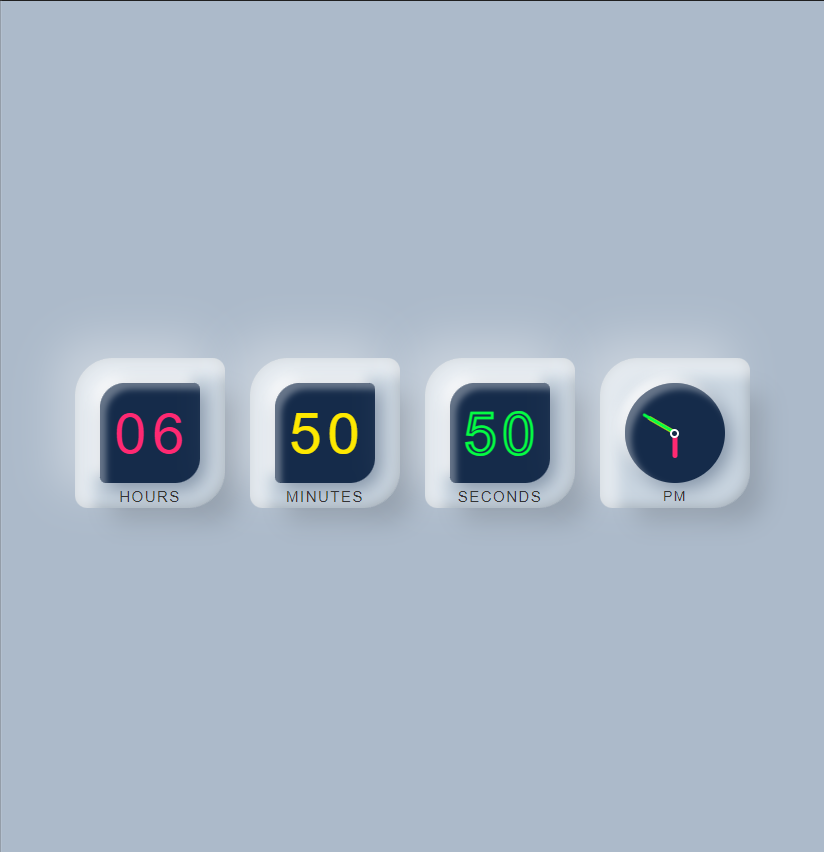
                <div class="projects-layer">
                    <h4>Clock 2</h4>
                    <p>Lorem ipsum dolor sit amet, consectetur adipisicing elit.</p>
                    <a href=""><i class="fa-solid fa-up-right-from-square"></i></a>
                </div>
            </div>
            <div class="projects-box">
                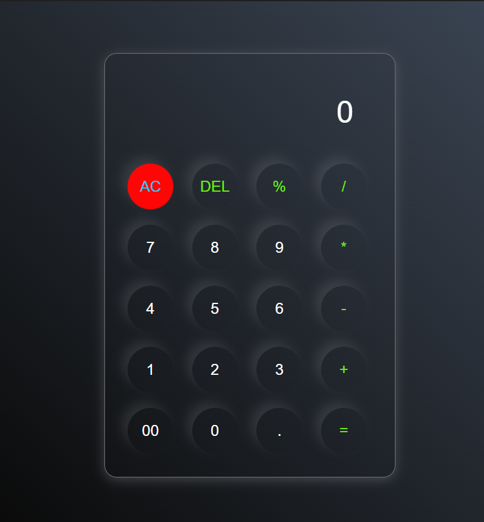
                <div class="projects-layer">
                    <h4>Calculator 1</h4>
                    <p>Lorem ipsum dolor sit amet, consectetur adipisicing elit.</p>
                    <a href=""><i class="fa-solid fa-up-right-from-square"></i></a>
                </div>
            </div>
            <div class="projects-box">
                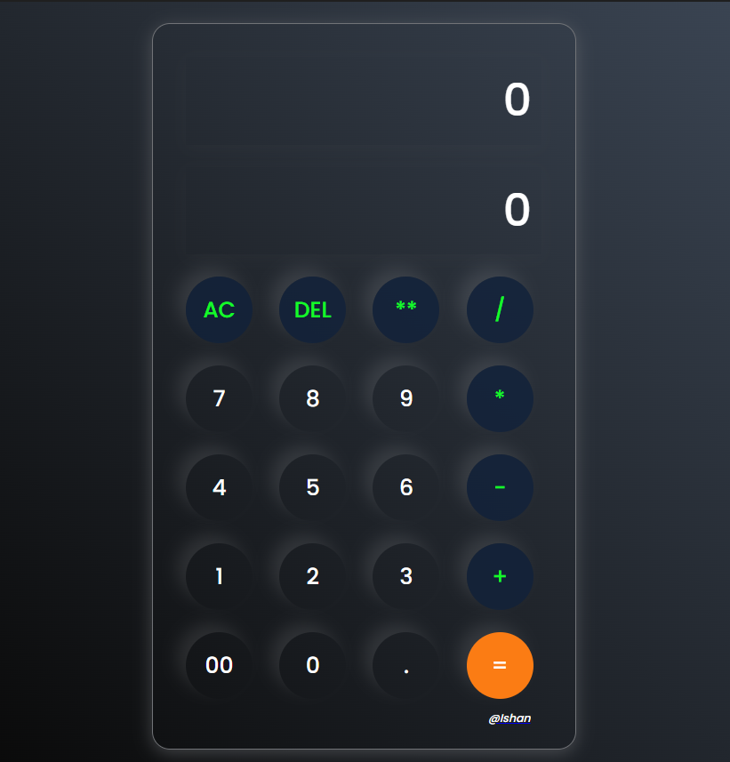
                <div class="projects-layer">
                    <h4>Calculator 2</h4>
                    <p>Lorem ipsum dolor sit amet, consectetur adipisicing elit.</p>
                    <a href=""><i class="fa-solid fa-up-right-from-square"></i></a>
                </div>
            </div>
            <div class="projects-box">
                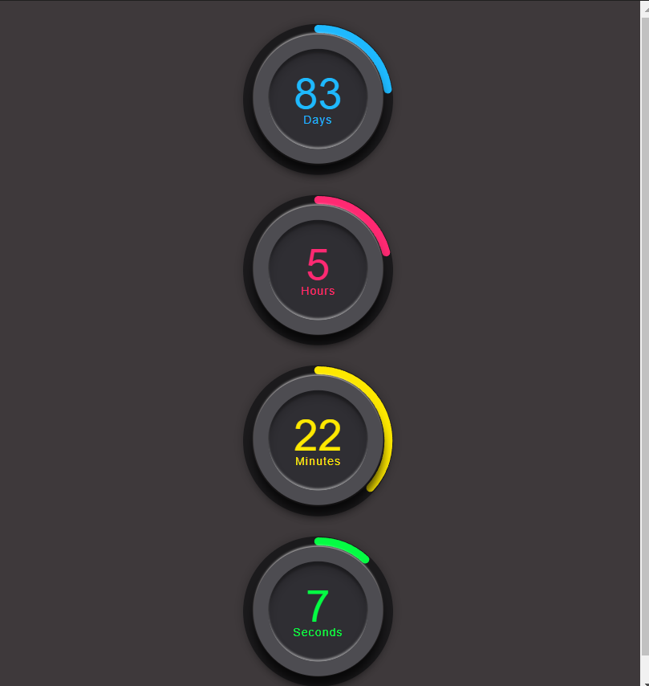
                <div class="projects-layer">
                    <h4>Count-down</h4>
                    <p>Lorem ipsum dolor sit amet, consectetur adipisicing elit.</p>
                    <a href=""><i class="fa-solid fa-up-right-from-square"></i></a>
                </div>
            </div>
            <div class="projects-box">
                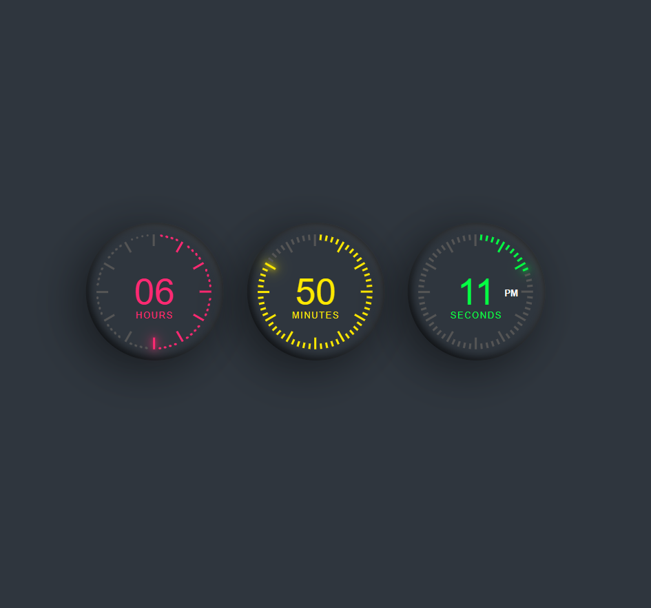
                <div class="projects-layer">
                    <h4>Timer</h4>
                    <p>Lorem ipsum dolor sit amet, consectetur adipisicing elit.</p>
                    <a href=""><i class="fa-solid fa-up-right-from-square"></i></a>
                </div>
            </div>
            <div class="projects-box">
                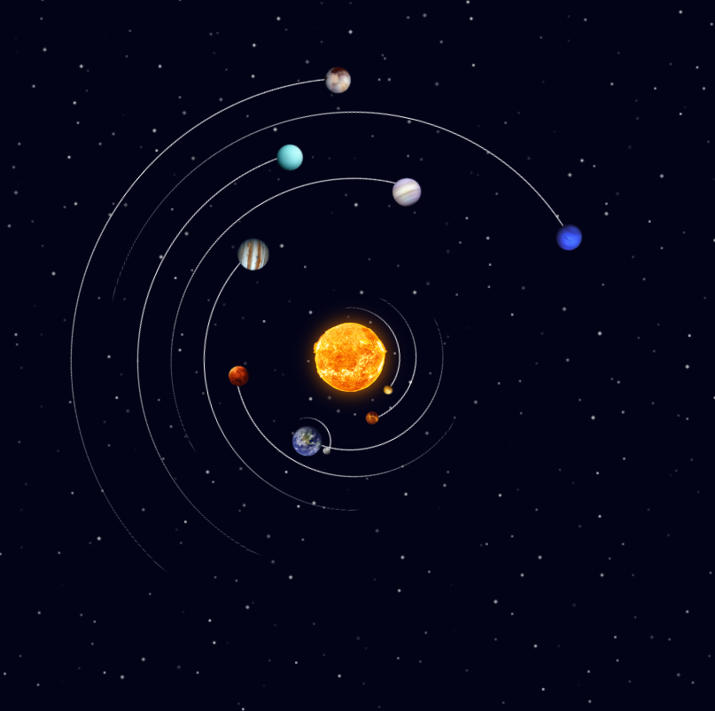
                <div class="projects-layer">
                    <h4>Solar System</h4>
                    <p>Lorem ipsum dolor sit amet, consectetur adipisicing elit.</p>
                    <a href=""><i class="fa-solid fa-up-right-from-square"></i></a>
                </div>
            </div>
            <div class="projects-box">
                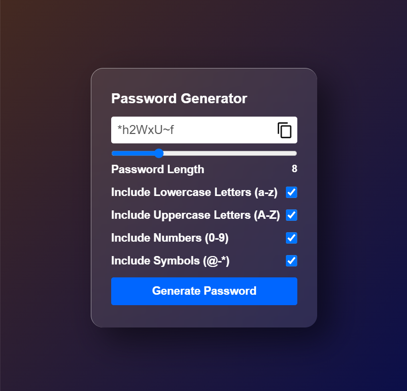
                <div class="projects-layer">
                    <h4>Password Generator</h4>
                    <p>Lorem ipsum dolor sit amet, consectetur adipisicing elit.</p>
                    <a href=""><i class="fa-solid fa-up-right-from-square"></i></a>
                </div>
            </div>
            <div class="projects-box">
                
                <div class="projects-layer">
                    <h4>Login</h4>
                    <p>Lorem ipsum dolor sit amet, consectetur adipisicing elit.</p>
                    <a href=""><i class="fa-solid fa-up-right-from-square"></i></a>
                </div>
            </div>
            <div class="projects-box">
                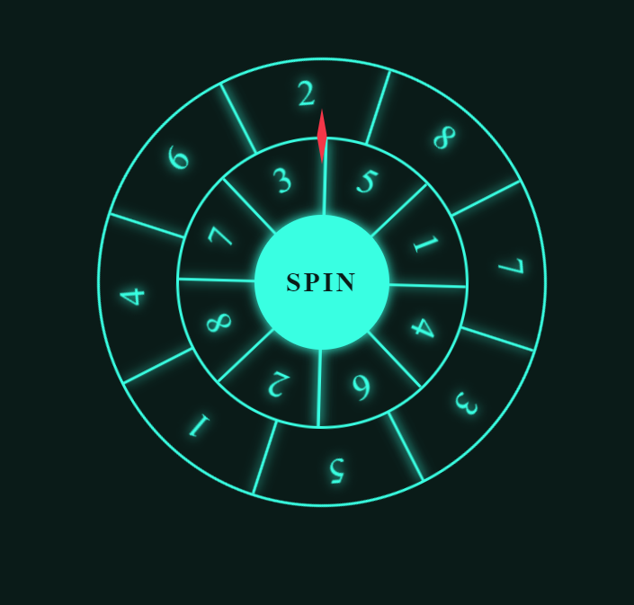
                <div class="projects-layer">
                    <h4>Spin Wheel</h4>
                    <p>Lorem ipsum dolor sit amet, consectetur adipisicing elit.</p>
                    <a href=""><i class="fa-solid fa-up-right-from-square"></i></a>
                </div>
            </div>
            <div class="projects-box">
                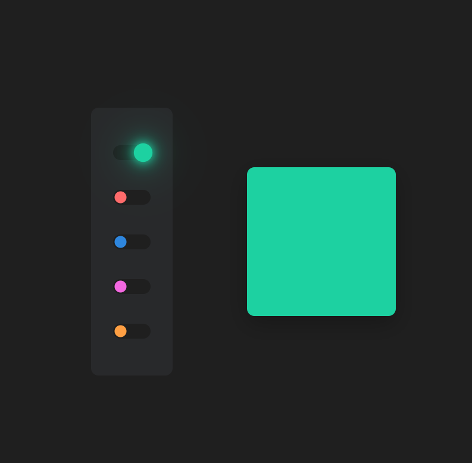
                <div class="projects-layer">
                    <h4>Sidebar</h4>
                    <p>Lorem ipsum dolor sit amet, consectetur adipisicing elit.</p>
                    <a href=""><i class="fa-solid fa-up-right-from-square"></i></a>
                </div>
            </div>
            <div class="projects-box">
                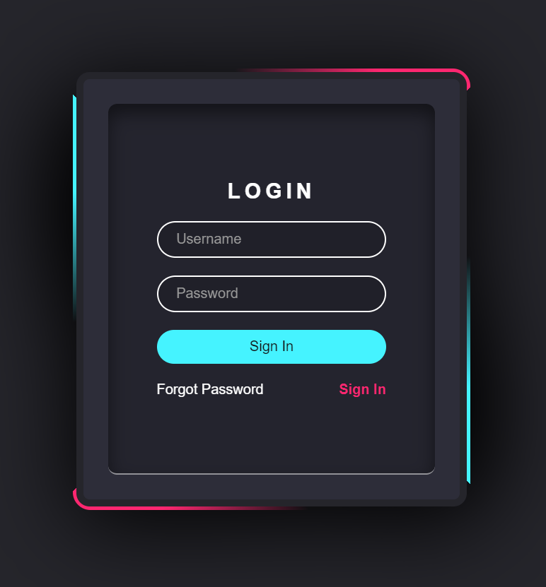
                <div class="projects-layer">
                    <h4>Login2</h4>
                    <p>Lorem ipsum dolor sit amet, consectetur adipisicing elit.</p>
                    <a href=""><i class="fa-solid fa-up-right-from-square"></i></a>
                </div>
            </div>
            <div class="projects-box">
                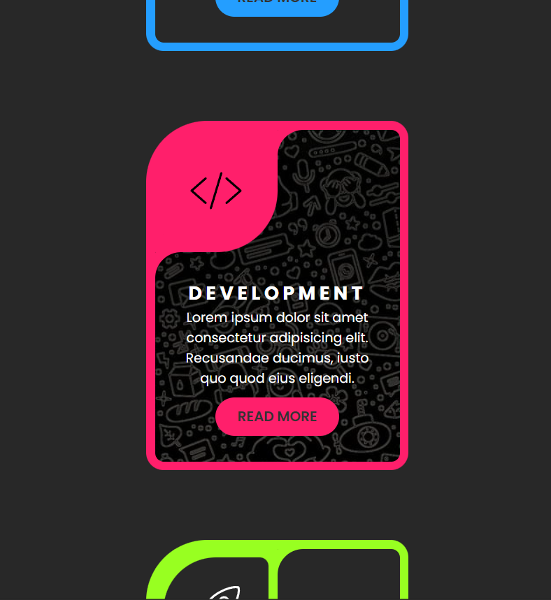
                <div class="projects-layer">
                    <h4>Card</h4>
                    <p>Lorem ipsum dolor sit amet, consectetur adipisicing elit.</p>
                    <a href=""><i class="fa-solid fa-up-right-from-square"></i></a>
                </div>
            </div>
            <div class="projects-box">
                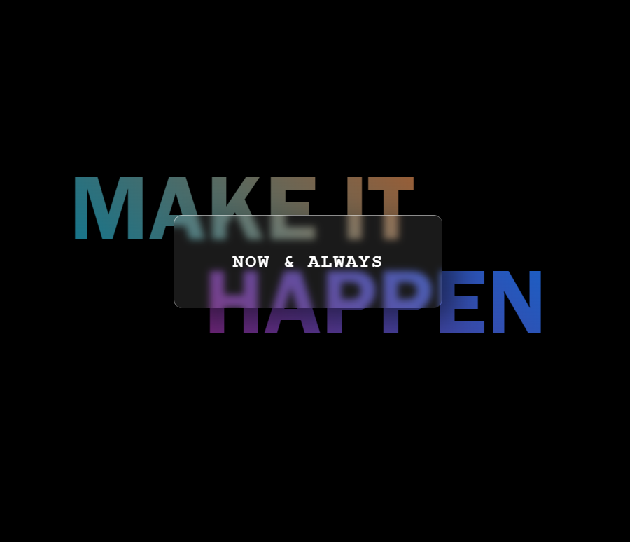
                <div class="projects-layer">
                    <h4>Wallpaper</h4>
                    <p>Lorem ipsum dolor sit amet, consectetur adipisicing elit.</p>
                    <a href=""><i class="fa-solid fa-up-right-from-square"></i></a>
                </div>
            </div>
            <div class="projects-box">
                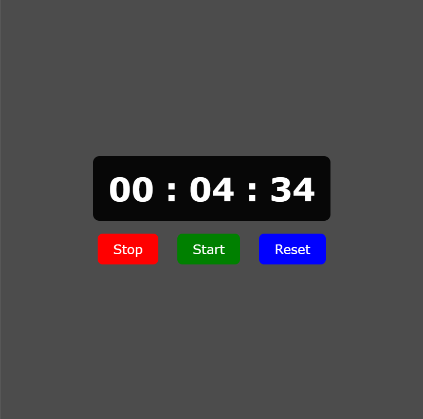
                <div class="projects-layer">
                    <h4>stopwatch</h4>
                    <p>Lorem ipsum dolor sit amet, consectetur adipisicing elit.</p>
                    <a href=""><i class="fa-solid fa-up-right-from-square"></i></a>
                </div>
            </div>
            <div class="projects-box">
                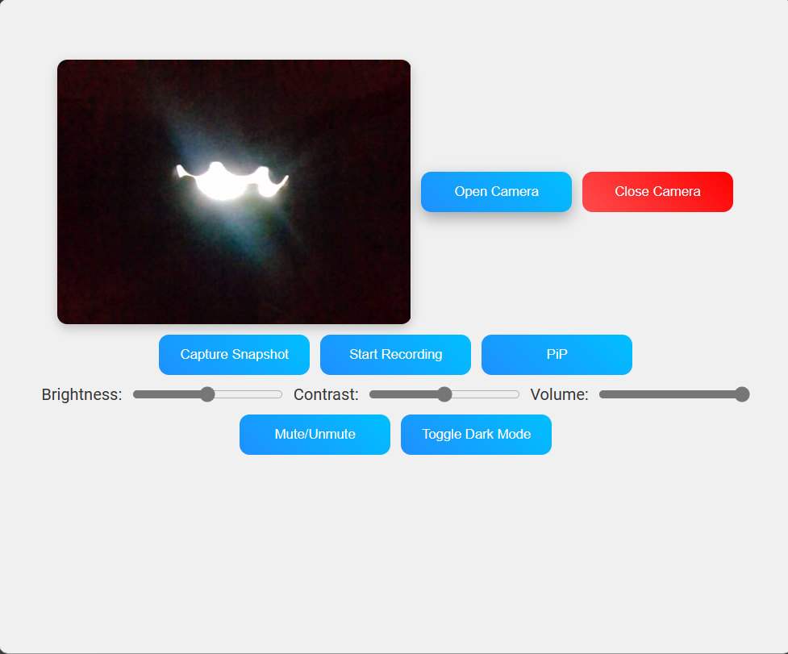
                <div class="projects-layer">
                    <h4>Camera</h4>
                    <p>Lorem ipsum dolor sit amet, consectetur adipisicing elit.</p>
                    <a href=""><i class="fa-solid fa-up-right-from-square"></i></a>
                </div>
            </div>
        </div>
    </section>

    
    <section class="contact">
        <div class="contact-content">
            <h1 class="section_title">Contact Me</h1>

            <p class="contact_description">I am  available for freelance work.Contact with me via phone:<a href="tel:+918975436452">8975436452 </a>or email: <a href="mailto:example@gmail.com">example@gmail.com</a>
            </p>

            <form class="contact_form" id="contact-form">
                <div class="contact_from-input">
                    <input type="text"  name="name"  placeholder="Your Name*"  class="contact_input"   id="contact-name"   required/>
                </div>

                <div class="contact_from-input">
                    <input type="email"  name="email"  placeholder="Your email*"  class="contact_input"   id="contact-email"   required/>
                </div>

                <div class="contact_from-input">
                    <input type="text"  name="subject"  placeholder="Write a subject*"  class="contact_input"   id="contact-subject"   required/>
                </div>

                <div class="contact_from-input">
                 <textarea name="message" id="contact-message" class="contact_input" placeholder="Your Message"></textarea>
                </div>

                <input type="submit" value="Submit" class="btn"/>

            </form>
        </div>
        
        <div class="im" id="con"></div>
    </section>
    <footer class="footer">
        <nav class="navbar" id="taskbar">
            <a href="#home"><i class="fa-solid fa-house"></i></a>
            <a href="#about"><i class="fa-solid fa-id-card"></i></a>
            <a href="#projects"><i class="fa-solid fa-list-check"></i></a>
            <a href="#contact"><i class="fa-solid fa-comments"></i></a>
            
        </nav>
    </footer>
  <script src="script.js"></script>
</body>
</html>
```

### CSS (style.css)

```css
*{
    margin: 0;
    padding: 0;
    box-sizing: border-box;
    font-family:'poppins' , sans-serif;
}
html{
    scroll-behavior: smooth;
}
body{
    color: #ededed;
    background:linear-gradient(90deg ,rgb(0, 0, 0),var(--base1) ) ;
    transition: 0.5s;
}

.header{
    position: fixed;
    top: 0;
    left: 0;
    width: 100vw;
    padding: 20px 10%;
    background: transparent;
    display: flex;
    justify-content: center;
    align-items: center;
    z-index: 100;
}
header.sticky{
    background:linear-gradient(90deg ,rgb(0, 0, 0),var(--base1) ) ;
    box-shadow: 0 0 20px var(--base2);
}

.logo{
    position: absolute;
    font-size: 25px;
    color: #ffffff;
    text-decoration: none;
    font-weight: 600;
    top: 20px;
    left: 5%;
    transition: 0.5s;
}
.logo:hover{
    color: red;
    transition: 0.5s;
}
.logo:hover span{
    color: #ededed;
    transition: 0.5s;
}
.logo span{
    color: red;
    transition: 0.5s;
}
.navbar a{
    width: 95px;
    display: inline-block;
    font-size:25px;
    color: #ededed;
    text-decoration: none;
    font-weight: 500;
    margin-left:35px ;
    text-align: center;
}
.navbar a.active {
    font-weight: 600;
    text-shadow: 0 0 20px var(--base2);
    border-bottom: 3px solid var(--base2); /* Blue underline */
    color: var(--base2); /* Text color change on active */
    transition: .7s;
  }
.navbar a:hover,h1:hover,h2:hover,h3:hover,h4:hover,h5:hover,p:hover{
    color: var(--base2);
    font-weight: 600;
    text-shadow: 0 0 20px var(--base2);
    transition: .4s;
    transition: 0.5s;
}
.home, .about{
    position: relative;
    width: 98vw;
    justify-content: space-between;
    height: 100vh;
    background-size: cover;
    display: flex;
    align-items: center;
    padding: 70px 10% 0;
    padding-block: 13rem 12rem;
}
.about{
    padding-block: 15rem 10rem;
}

.home-content, .about-content{
    max-width: 600px;
}
.home-content h3{
    font-size: 32px;
    font-weight: 700;

}
.home-content h1{
    font-size: 56px;
    font-weight: 700;
    margin: -3px 0;
}

.home-content p{
    font-size: 20px;
}
.home-sci a,#toggle-music{
    display:inline-flex;
    justify-content: center;
    align-items: center;
    width: 40px;
    height: 40px;
    background: transparent;
    border-radius: 50%;
    font-size: 20px;
    color: var(--base2);
    text-decoration: none;
    margin: 30px 15px 30px 0;
}
#toggle-music{
    padding: 0;
    margin: 0;
    position: absolute;
    top: 15px;
    left: 15%;
    border: none;
}

.contact{
    position: relative;
    width: 98vw;
    justify-content: space-between;
    height: 100vh;
    background-size: cover;
    display: flex;
    align-items: center;
    padding: 70px 10% 0;
}
.contact-content{
    width: 40%;
    border-radius: 20px;
    padding: 28px 32px;
    display: flex;
    flex-direction: column;
    box-shadow: 20px 20px 50px rgba(0, 0, 0, 0.5);
    background: rgba(255, 255, 255, 0.1);
    border-top: 1px solid rgba(255, 255, 255, 0.5);
    border-left: 1px solid rgba(255, 255, 255, 0.5);
    -webkit-backdrop-filter: blur(6px);
    backdrop-filter: blur(6px);
}
#toggle-music:hover{
    background: var(--base2);
    color: var(--base1);
    box-shadow: 0 0 20px var(--base2);
    transition: .3s;
}
.home-sci a:hover{
    background: var(--clr);
    color: #ffffff;
    box-shadow: 0 0 20px var(--base2);
    transition: .3s;
}
.btn-box{
    position: absolute;
    right:5%;
    top: 13px;
    text-decoration: none;
    padding: 12px 28px;
    color: #ededed;
    border-radius: 20px;
    box-shadow: 20px 20px 50px rgba(0, 0, 0, 0.5);
    background: rgba(255, 255, 255, 0.1);
    border-top: 1px solid rgba(255, 255, 255, 0.5);
    border-left: 1px solid rgba(255, 255, 255, 0.5);
    -webkit-backdrop-filter: blur(6px);
    backdrop-filter: blur(6px);
    display: flex;
    flex-direction: row;
    display: inline-block;
    font-size: 16px;
    letter-spacing: 2px;
    font-weight: 600;
}
.section_title{
    margin-bottom: 2rem;
    letter-spacing: 0.1em;
    text-transform: uppercase;
    font-weight: 600;
    font-size: 30px;
}
.contact_description{
    margin-bottom: 3rem;
}
.contact_description a{
    text-decoration: none;
    color: #ededed;
}
.contact_input{
    border: 2px solid;
    padding: 0.8rem 1.25rem;
    width: 100%;
    border-radius:  50px;
    font-size:  15px; 
    margin-bottom: 1.25rem;
}
.btn{
    display: inline-block;
    background:transparent;
    color:var(--base2) ;
    border: 2px solid ;
    border-radius: 2cm;
    padding: 1rem 2.5rem;
    font-size: medium;
    font-weight: 500;
    letter-spacing: 2px;
    cursor: pointer;
    transition: all 0.3s;
}
.btn:hover{
    background-color:var(--base2);
    color:var(--base1);
    font-weight: 700;
}
.btn-box:hover{
    backdrop-filter: blur(0);
    background: var(--base2);
    color: var(--base1);
    box-shadow: 0 0 20px var(--base2);
}
.home_img,.about_img,.contact_img{
    width: 420px;
    height: 420px;
    border-radius: 50%;
    box-shadow: 0 0 70px var(--base2);
    transition: 0.4s;
}
.home_img:hover,.about_img:hover,.contact_img:hover{
    width: 450px;
    height: 450px;
    transition: 0.4s;
}

/* projects */
.projects{
    padding-top: 5rem;
    margin-bottom: 3rem;
}
.projects h2{
    margin-bottom: 2rem;
}

.projects-content{
    display: grid;
    grid-template-columns: repeat(4,1fr);
    align-items: center;
    gap: 2.9rem;
    margin-left: 2rem;
}
.projects-content .projects-box{
    width: 90%;
    position: relative;
    border-radius: 2rem;
    box-shadow: 0 0 1rem var(--base2);
    overflow: hidden;
    display: flex;
}
.projects-box img{
    width: 100%;
    transition: .5s ease;
    opacity: 0.7;
}
.projects-box:hover img{
    transform: scale(1.1);
}
.projects-box .projects-layer{
    position: absolute;
    bottom: 0;
    left: 0;
    width: 100%;
    height: 100%;
    background: linear-gradient(rgba(0,0,0,0.1) , var(--base1));
    display: flex;
    justify-content: center;
    align-items: center;
    flex-direction: column;
    text-align: center;
    padding: 0 4rem;
    transform: translateY(100%);
    transition: .5s ease;
}
.projects-box:hover .projects-layer{
    transform: translateY(0);
}
.projects-layer h4{
    font-size: 2rem;
}
.projects-layer p{
    font-size: 1.3rem;
    margin: .3rem 0 1rem;
}
.projects-layer a{
    display: inline-flex;
    justify-content: center;
    align-items: center;
    width: 2rem;
    height: 2rem;
    background: #ededed;
    border-radius: 50%;
}
.projects-layer a i{
    font-size: 1rem;
    color: var(--base1);
}
.heading{
    text-align: center;
    font-size: 3rem;
}
.heading span{
    color: var(--base2);
}
#taskbar{
    display: none;
}


/* @media all and (min-width: 1001px) {

}

@media all and (max-width: 1000px) and (min-width: 610px) {
  
} */

@media all and (max-width: 609px){ 
    .btn-box{
        padding: 6px 8px;
        font-size: 11px;
        top: 17%;
        letter-spacing: 1px;
    }
    .logo{
        font-size: 24px;
        top: 14%;
    }
    .home_img{
        border-radius: 20px;
        width: 250px;
        height: 250px;
        margin-top: 20px;
    }
    .home-content{
        padding-top: 20%;
    }
    .home-content h1{
        font-size: 46px;
        font-weight: 700;
    }
    .contact_img{
        width: 320px;
        height: 320px;
    }
    .about_img{
        width: 280px;
        height: 280px;
    }
    .im{
        display: flex;
        justify-content: center;
    }
    .contact .im{
        align-items: center;
    }
    .footer{
        position: fixed;
        bottom: 0px;
        width: 100vw;
        padding: 10px 10%;
        background: linear-gradient(90deg ,rgb(0, 0, 0),var(--base1) );
        display: flex;
        justify-content: center;
        align-items: center;
        z-index: 100;
    }
    .contact-content{
        width: 100%;
        margin-top: 30%;
    }
    .section_title{
        margin-bottom: 1rem;
        font-size: 20px;
    }
    .contact_input{
        padding: 0.4rem;
        font-size:  15px; 
        margin-bottom: 1.25rem;
    }
    footer{
        background:linear-gradient(90deg ,rgb(0, 0, 0),var(--base1) ) ;
        box-shadow: 0 0 20px #206c69;
        border-radius: 50px;
    }
    .about,.home,.contact{
        display:block;
        padding-block: 90px;
    }
    .navbar a{
        margin-left:35px ;
        width: auto;
    }
    .navbar{
        margin-left: -35px;
    }
    .home-sci a{
        margin-top: 30px;
    }
    #toggle-music{
        top: 7px;
        left: 34%;
        font-size: 12px;
        width: 25px;
        height: 25px;
    }.projects-content{
        grid-template-columns: repeat(2,1fr);
        gap: 2rem;
        margin-left: 1rem;
    }
    .heading{
        font-size: 2rem;
    }
    .projects-layer h4{
        font-size: 1.2rem;
    }
    .projects-layer p{
        font-size: 0.8rem;
        margin: 0rem 0 -1rem;
    }
    .projects-layer a{
        width: 1.2rem;
        height: 1.2rem;
    }
    .projects-layer a i{
        font-size: 0.5rem;
    }
    .home_img:hover{
        width: 270px;
        height: 270px;
        transition: 0.4s;
    }
    .about_img:hover{
        width: 290px;
        height: 290px;
        transition: 0.4s;
    }
    .contact_img:hover{
        width: 10px;
        height: 140px;
        transition: 0.4s;
    }
    
    .contact_description{
        margin-bottom: 1rem;
    }
    .btn{
        border-radius: 50px;
        padding: 0.5rem 1.5rem;
        font-size:14px;
    }
    .contact_img{
        z-index: -10;
    }
    #taskbar{
        display:block;
    }
    #con{
        display: none;
        position: absolute;
    }
    #navbar{
        display: none;
    }
}
```
### JavaScript (script.js)

```js
window.addEventListener("scroll",function(){
  var header = document.querySelector("header");
  header.classList.toggle("sticky",window.scrollY > 0)
});
// Get all navigation links
const navLinks = document.querySelectorAll('.navbar a');

// Get all sections by their class names (which are mapped to navigation links)
const sections = Array.from(navLinks).map(link => {
  const sectionName = link.getAttribute('href').substring(1); // Get class name from href
  return document.querySelector(`.${sectionName}`); // Find section by class name
});

// Scroll to section on link click
navLinks.forEach(link => {
  link.addEventListener('click', (event) => {
    event.preventDefault(); // Prevent default anchor behavior
    
    const sectionName = link.getAttribute('href').substring(1); // Get class name from href
    const targetSection = document.querySelector(`.${sectionName}`); // Find section by class name

    // Scroll to the section smoothly
    if (targetSection) {
      targetSection.scrollIntoView({ behavior: 'smooth' });
    }
  });
});

// Highlight active section based on scroll position
window.addEventListener('scroll', () => {
  let currentSection = '';

  // Determine which section is in view
  sections.forEach(section => {
    const sectionTop = section.offsetTop; // Get section's top offset
    const sectionHeight = section.clientHeight; // Get section's height
    
    if (window.scrollY >= sectionTop - sectionHeight / 3) {
      currentSection = section.classList[0]; // Update current section
    }
  });

  // Update the "active" class for the correct navigation link
  navLinks.forEach(link => {
    link.classList.remove('active'); // Remove "active" from all links
    
    const sectionName = link.getAttribute('href').substring(1); // Get class name from href
    if (sectionName === currentSection) {
      link.classList.add('active'); // Add "active" to the correct link
    }
  });
});

// JavaScript to control music playback
const audioElement = document.getElementById("background-music");
const toggleButton = document.getElementById("toggle-music");

toggleButton.addEventListener("click", () => {
  if (audioElement.paused) {
    audioElement.play(); // Play music
    toggleButton.innerHTML = `<i class="fa-solid fa-volume-high"></i>`; // Change button text
  } else {
    audioElement.pause(); // Pause music
    toggleButton.innerHTML =`<i class="fa-solid fa-volume-xmark"></i>`; // Change button text
  }
});
```

Thank you for reading .
Made by [Ishan Maiti](https://github.com/Ishan0121).
